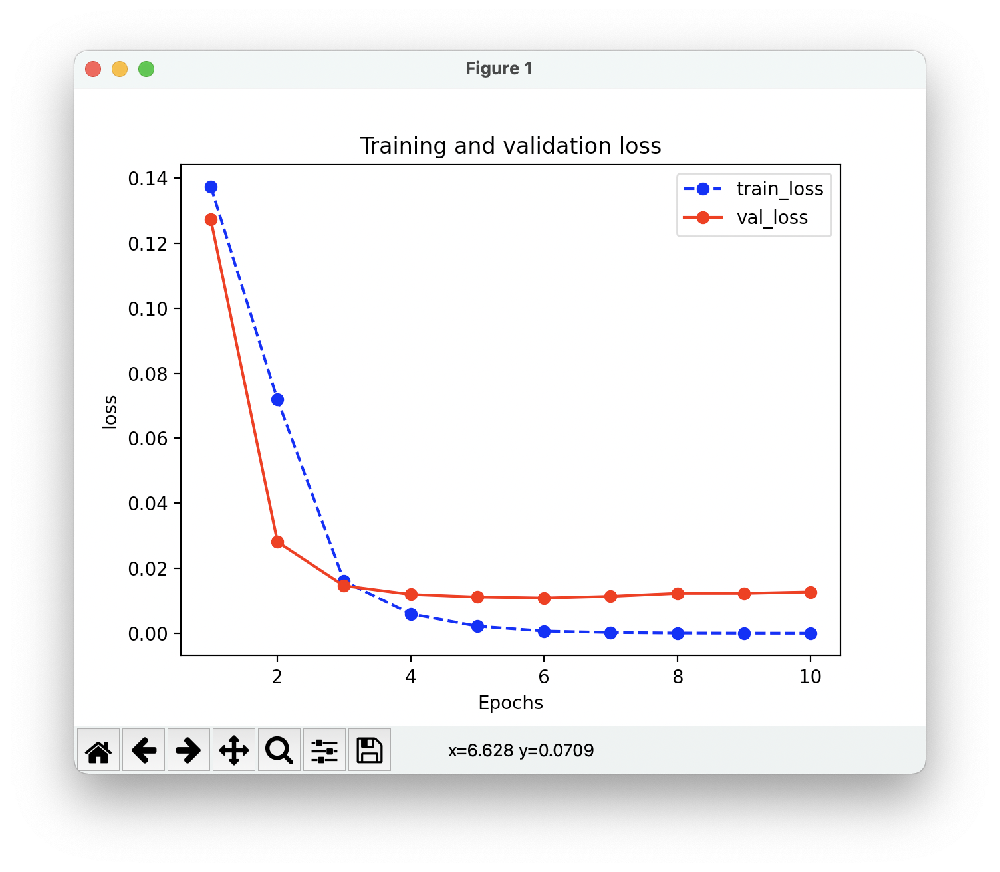

# Simple OCR
A simple CNN model for identifying verification codes implemented by pytorch.

## Development Environment

### Platform
macOS Big Sur 11.4 (Apple Silicon)

### Requirements
```angular2html
python == 3.9.6
torch == 1.8.0
torchvision == 0.9.0a0
```

## Test
First unzip <code>data.tar.gz</code> in the root directory
```shell
python test.py -o ./data/result/prediction.csv
```

### Learning Curve
</img>

### Complaint
It’s 2021, why pytorch still doesn’t support M1 GPU acceleration? torchkeras is not even compatible with Apple Silicon at all!